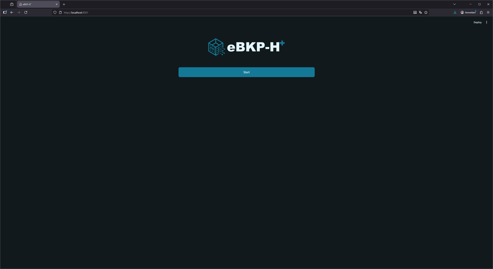
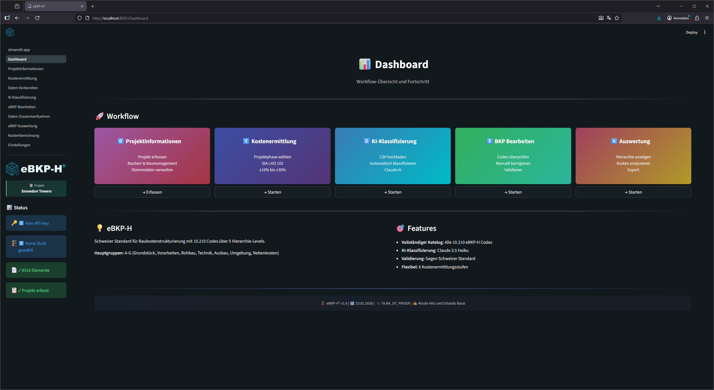
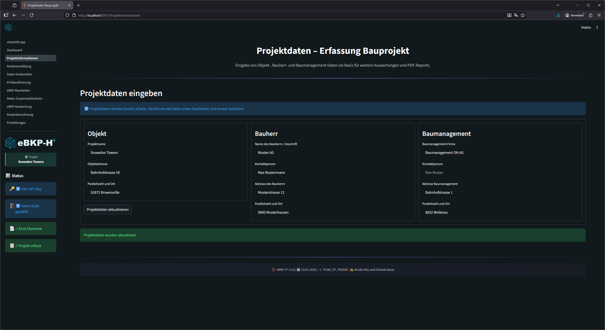
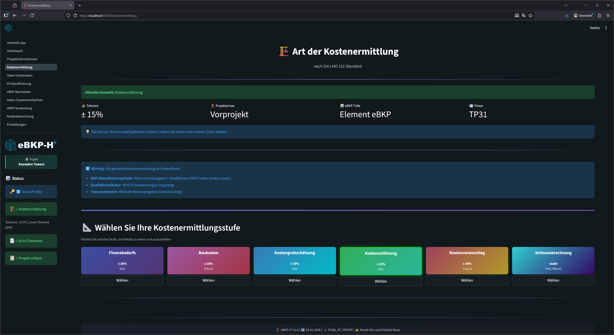
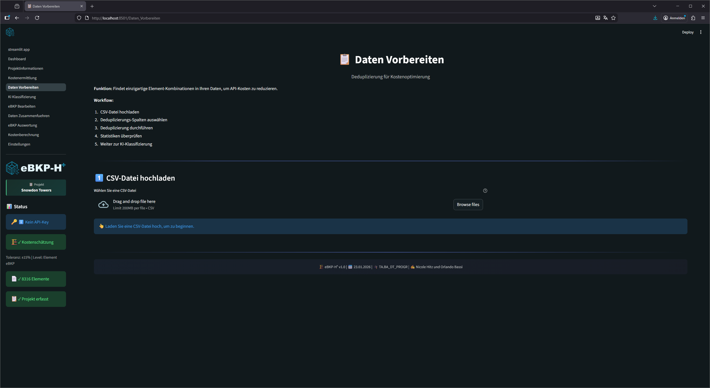
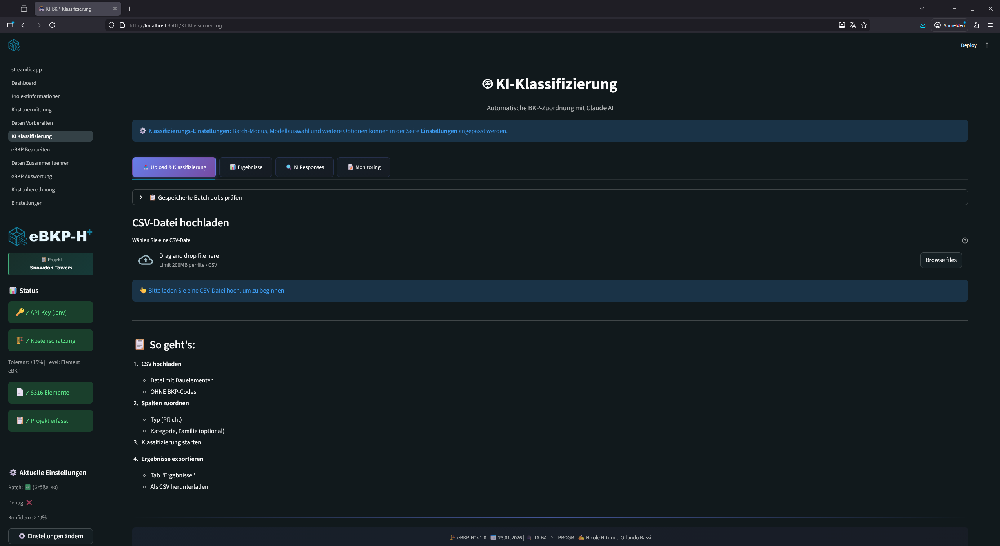
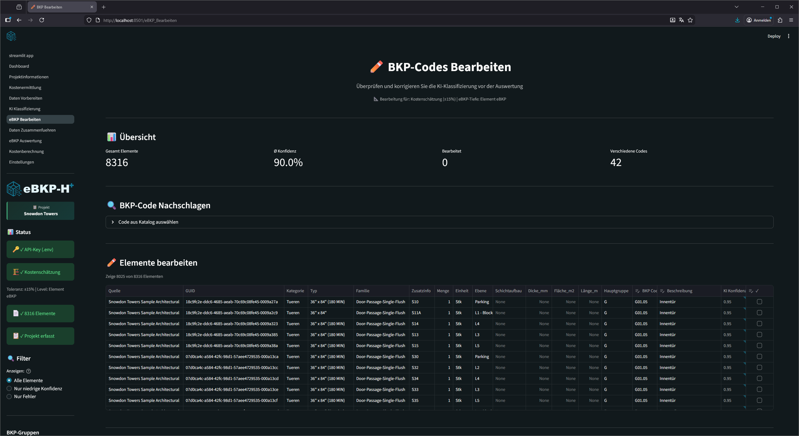
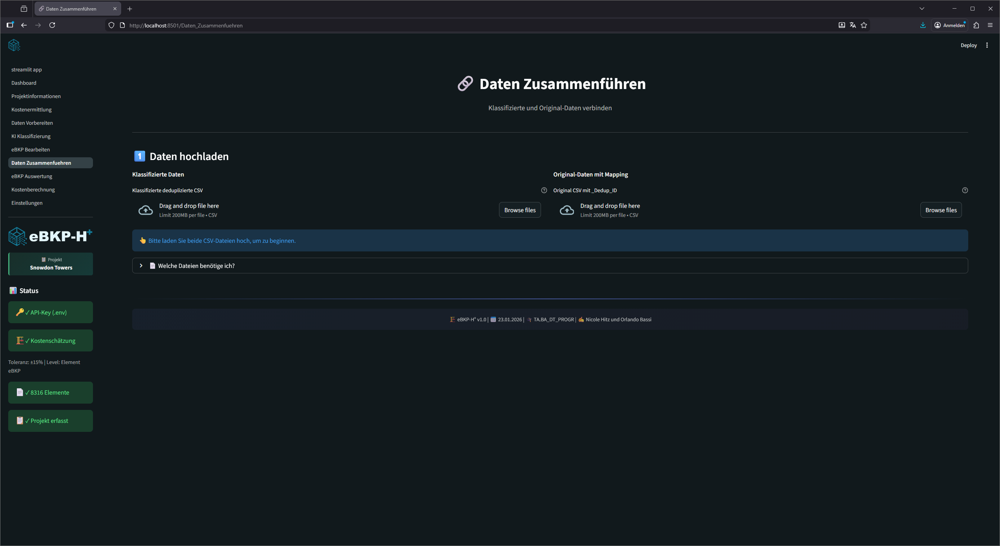
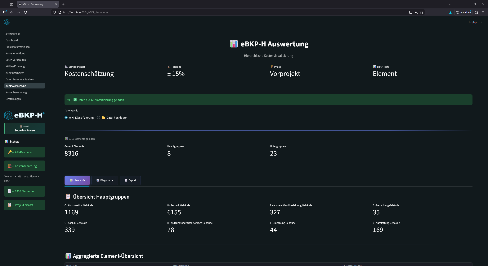
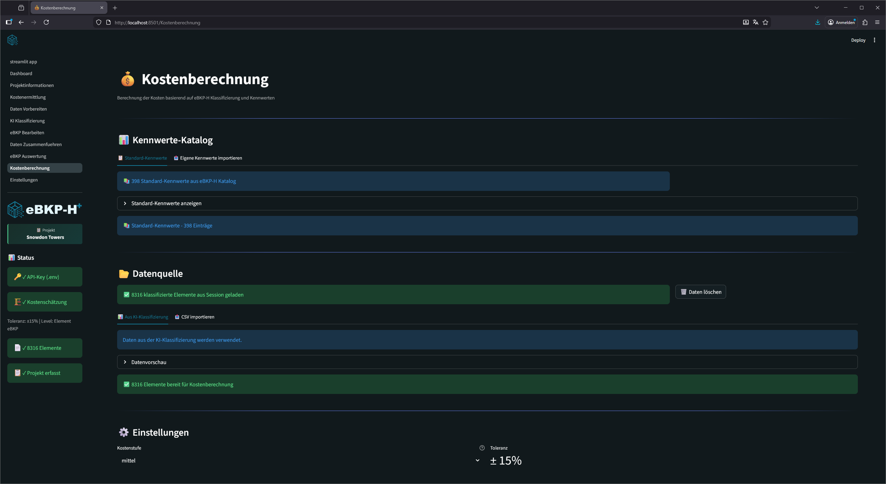

<style>
section { font-size: 30px; }
</style>

<!-- _header: "" -->
<!-- _footer: "22. Januar 2026" -->
<!-- _paginate: skip -->
<!-- _class: invert -->


# eBKP⁺
eBKP-H Klassifizierung und Ausmass
⎯⎯⎯⎯⎯⎯⎯⎯⎯⎯⎯⎯⎯⎯⎯⎯⎯⎯⎯⎯
Ein pyRevit-Plugin von Nicole und Orlando

---

## Konzept

- Datenauswertung mit **pyRevit** direkt aus dem Revit Modell
- Schnelles, modellbasiertes **Ausmass nach eBKP-H**
  mit Anthropic's [Haiku](https://www.anthropic.com/claude/haiku) KI-Modell
- Visualisierung und Export mit **Streamlit**

---

## Entwicklungsumgebung

- [Visual Studio Code](https://code.visualstudio.com/) als IDE
- Virtual Environment mit Python **3.13.7**
- [pyRevit](https://pyrevitlabs.notion.site/) als Schnittstelle zwischen Python und Revit
- [GitHub](https://github.com/NH-HSLU/TA.BA_DT_PROGR) Repository

#### zusätzliche Tools:

- [Mermaid](https://www.mermaidchart.com/) Flowchart-Diagramme erstellen
- [Marp](https://marp.app/) Slides aus Markdown-Syntax

---

## Python-Bibliotheken

**Datenanalyse**

```
numpy           # Numerische Berechnungen und Arrays   
pandas          # Tabellen-Verarbeitung und Analyse
```

**Visualisierung**

```
matplotlib      # Datenplotting und Visualisierung
plotly          # Diagramme und Dashboards.        
streamlit       # Apps und Dashboards.             
```

**Sonstige nützliche Tools**

```
openpyxl        # Verarbeitung von Excel-Dateien (.xlsx).  
```

---

## Herausforderungen

- Datenexport mit Schichtaufbau aus Revit
- Prompt für eBKP-H Kategorisierung > Antwort in **JSON** Format
- richtige Kostenberechnung mit Kostenkatalog

---

## Erfolge

- eBKP-H Kategorisierung mit KI
- Export aus pyRevit
- übersichtliche Visualisierung in Streamlit
- Export Kostenberechnung

---

<!-- _header: "" -->
<!-- _footer: "" -->
<!-- _paginate: skip -->
<!-- _class: invert -->

# STREAMLIT

Klassifizierung mit Haiku
Visualisierung der Ergebnisse
Kostenberechnung

---



---

!

---



---



---



---



---



---



---



---



---

## Erkenntnisse

- ~~Einzelne Bauteil-Kategorien pro Liste Auswerten~~
  ➤ Alle Bauteil-Kategorien in einer Liste Auswerten
- Claude funktioniert viel besser mit `#TODO Änderung` als reinem umschreiben vom Problem das gelöst werden soll
- Gute Promts schreiben "Du bist ein Softewareentwickler und machst..."
- Teilsweise sinnvoll von neuem zu beginnen als der Fehler zu suchen (Kostenberechnung)

---

### Projektziele erreicht

1. Alle Elemente in einer **Excel**-Liste exportieren
3. **Streamlit**-Dashboard erstellen
4. Auswertung als **PDF** exportieren
5. **Kostenberechnung** nach verschiedenen Methoden

---

### Erweiterung vom Projekt

1. Kostenberechnung auf Genauigkeit überprüfen => mit Experten sprechen
2. ArchiCAD Plugin und IFC kompatibel machen
3. EXE Datei

---

<!-- _header: "" -->

<!-- _footer: "" -->

<!-- _paginate: skip -->

<!-- _class: invert -->

> If a picture is worth a thousand words,
>
> a prototype is worth a thousand meetings,

— *Tom & David Kelley, IDEO*
