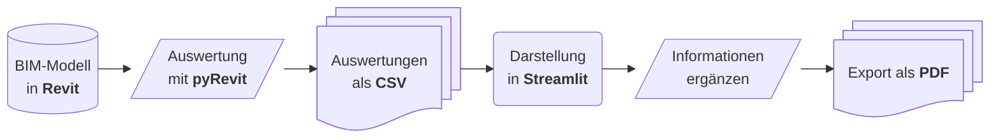
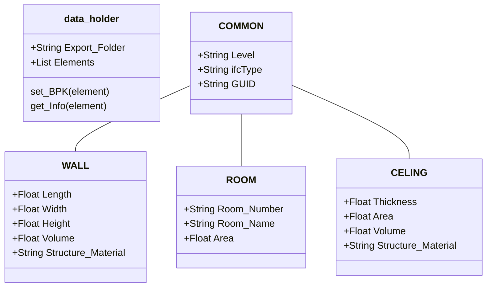
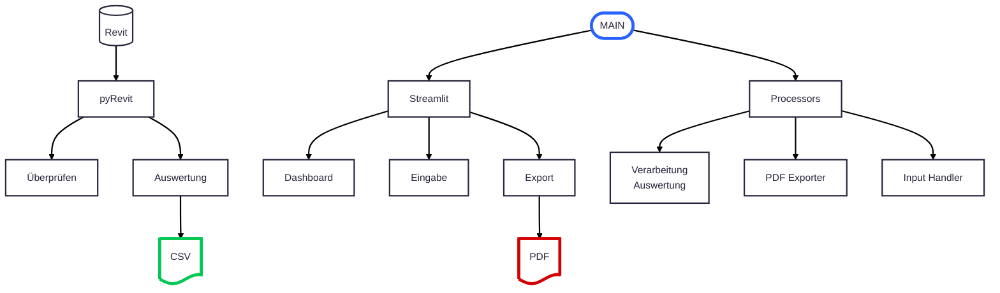

# TA.BA_DT_PROGR

## Abgaben

- Zwischenprüfung 1	[Milestone ZP1](https://github.com/NH-HSLU/TA.BA_DT_PROGR/milestone/1)
- Zwischenprüfung 2	[Milestone ZP2](https://github.com/NH-HSLU/TA.BA_DT_PROGR/milestone/2)
- Modulendprüfung		[Milestone MEP](https://github.com/NH-HSLU/TA.BA_DT_PROGR/milestone/3)

## Konzept

Der folgende Workflow zeigt eine übersicht der verschiedenen Schritte, welche unserer Applikation hat.

## Datenstruktur

Für eine Effiziente Auswertung und Handhabung der Daten haben wir uns für den Datenaustausch für folgende Datanstruktur entschieden:

## Python Module

Die Pythonmodule sind für eine einfachere Handhabung und Modularität in folgende Files unterteilt:

