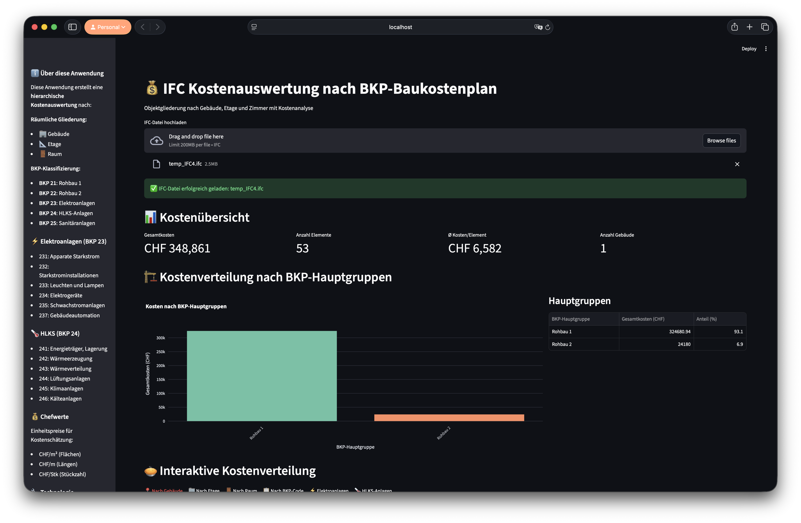

<style>
section { font-size: 30px; }
</style>

<!-- _header: "" -->
<!-- _footer: "27. Oktober 2025" -->
<!-- _paginate: skip -->
<!-- _class: invert -->

# Ausmass und Kostenvoranschlag

_Ein pyRevit-Plugin von Nicole und Orlando_

---

## Konzept

- Datenauswertung mit **pyRevit**
- Schnelles, modellbasiertes **Ausmass nach BKP**
- Visualisierung und Export mit **Streamlit**

---

## Entwicklungsumgebung

- [Visual Studio Code](https://code.visualstudio.com/) als IDE
- Virtual Environment mit Python **3.13.7**
- [pyRevit](https://pyrevitlabs.notion.site/) als Schnittstelle zwischen Python und Revit
- [GitHub](https://github.com/NH-HSLU/TA.BA_DT_PROGR) Repository

#### zusätzliche Tools:

- [Mermaid](https://www.mermaidchart.com/) Flowchart-Diagramme erstellen
- [Marp](https://marp.app/) Slides aus Markdown-Syntax

---

## Workflow


---

## Program Structure


---

## Data Structure



---

## Python-Bibliotheken

**Datenanalyse**

```
numpy           # Numerische Berechnungen und Arrays       
pandas          # Tabellen-Verarbeitung und Analyse
```

**Visualisierung**

```
matplotlib      # Datenplotting und Visualisierung
plotly          # Diagramme und Dashboards.                
streamlit       # Apps und Dashboards.                     
```

**Sonstige nützliche Tools**

```
openpyxl        # Verarbeitung von Excel-Dateien (.xlsx).  
```

---

## Herausforderungen

- Revit Grundverständnis Erarbeiten
- pyRevit-Intellisense und Autocomplete
- Geeignete pyRevit Tutorials finden

---

## Erfolge

- erste Auswertung mit pyRevit
- GitHub einrichten mit Collaborators
- neue Tools Kennengelernt [[Mermaid](https://www.mermaidchart.com/) / [Marp](https://marp.app/)]

---

Entwurf von einem Dashboard in Streamlit


---

## Nächste Schritte

1. Alle Elemente in einer **Excel**-Liste exportieren
2. Elemente mit **BKP** klassifizieren
3. **Streamlit**-Dashboard erstellen
4. Auswertung als **PDF** exportieren

---

<!-- _header: "" -->
<!-- _footer: "" -->
<!-- _paginate: skip -->
<!-- _class: invert -->

> ​
> ​
> Tell me and I forget,
> 
> teach me and I may remember,
> 
> involve me and I learn.
> ​
> ​

— *Benjamin Franklin*