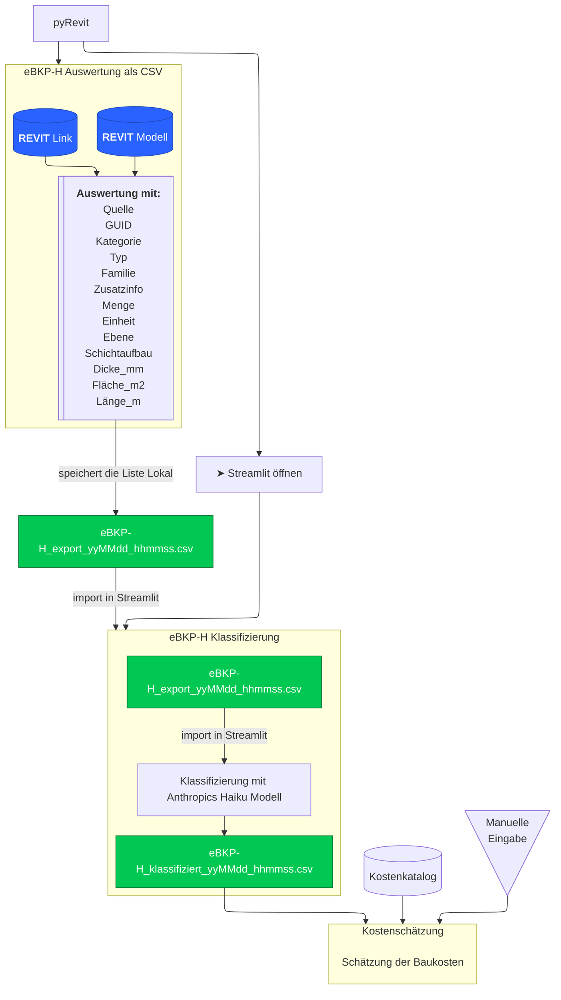

```mermaid
---
config:
  layout: elk
---
flowchart TB
 subgraph s1["eBKP-H Auswertung als CSV"]
        n4["<b>REVIT</b> Modell"]
        n5["<b>REVIT</b> Link"]
        n6["<b>Auswertung mit:</b><br>Quelle<br>GUID<br>Kategorie<br>Typ<br>Familie<br>Zusatzinfo<br>Menge<br>Einheit<br>Ebene<br>Schichtaufbau<br>Dicke_mm<br>Fläche_m2<br>Länge_m"]
  end
 subgraph s2["eBKP-H Klassifizierung"]
        n9@{ label: "<span style=\"color:\">eBKP-H_export_yyMMdd_hhmmss.csv</span>" }
        n10["Klassifizierung mit Anthropics Haiku Modell"]
        n11["eBKP-H_klassifiziert_yyMMdd_hhmmss.csv"]
  end
 subgraph s3["Kostenschätzung"]
        n13["Schätzung der Baukosten<br>"]
  end
    n4 --> n6
    n5 --> n6
    n6 -- speichert die Liste Lokal --> n7["eBKP-H_export_yyMMdd_hhmmss.csv"]
    n9 -- import in Streamlit --> n10
    n10 --> n11
    n7 -- import in Streamlit --> s2
    n2["pyRevit"] --> s1 & n12["➤ Streamlit öffnen"]
    n12 --> s2
    n11 --> s3
    n14["Kostenkatalog"] --> s3
    n15["Manuelle<br>Eingabe"] --> s3

    n4@{ shape: db}
    n5@{ shape: db}
    n6@{ shape: lin-proc}
    n9@{ shape: rect}
    n13@{ shape: text}
    n7@{ shape: proc}
    n14@{ shape: db}
    n15@{ shape: manual-file}
     n4:::REVIT
     n5:::REVIT
     n9:::excel
     n11:::excel
     n7:::excel
    classDef REVIT stroke:#214aba, fill:#2962FF, color:#FFFFFF
    classDef excel stroke:#00692c, fill:#00C853, color:#FFFFFF
```