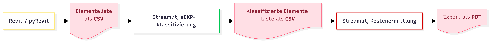
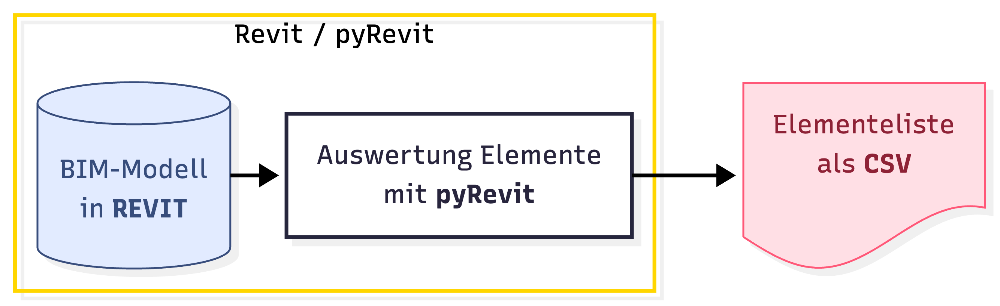
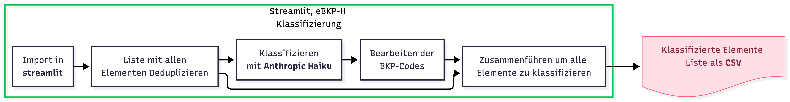
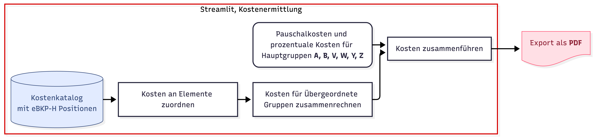

27.Januar 2026

# Übersicht

Mit unserem Programm eBKP-H⁺ können Sie ihr Revit Modell in wenigen Klicks nach eBKP-H gliedern
und eine Kostenzusammenstellung erstellen.

Verwenden sie einen unternehmensinternen Kostenkatalog,
um die Kostenplanung auf Ihr Unternehmen anzupassen.

# Installation

Die Software kann über GitHub heruntergeladen
werden.

Die benötigten Python Pakete können mit dem
Befehl `pip install -r requirements.txt` installiert oder aktualisiert werden.

# Struktur

Das System besteht aus mehreren Komponenten:

**Revit**

- pyRevit extension mit Elementauswertung

**Python**

Streamlit Web-App

- Dashboard
- Projektinformationen
- Kostenermittlung
- Daten Vorbereitung
- KI Klassifizierung
- eBKP Bearbeiten
- Daten Zusammenführen
- Auswertung eBKP-H
- Kostenberechnung
- Einstellungen

Hilfsfunktionen

- Session State
- Benachrichtigungen
- Sidebar
- eBKP-H Elementeliste
- Kostenkatalog

# Auswertung mit pyRevit

Die Auswertung vom Revit Modell erfolgt
über ein pyRevit Skript, das direkt in der Benutzeroberfläche ausgeführt werden
kann. Im Auswahlfenster können die gewünschten Elemente für den Export gewählt
werden. Es können Elemente aus der aktuellen Datei und den enthaltenen Links
gewählt werden.

Die Elemente werden mit den benötigten Infos
wie Materialität, Typenbezeichnung und Massen in eine CSV exportiert.

# Klassifizierung

Die exportiere Elementliste wird vor der
Klassifizierung auf Duplikate überprüft. Daraus entsteht eine bereinigte Liste,
in der jeder Elementtyp nur einmal vorkommt. Diese Optimierung reduziert die
benötigten Rechenzeit und Kosten für die Klassifizierung. Die bereinigte Liste
wird in Batches über eine vordefinierte Prompt-Struktur an die Anthropic API
gesendet. Die Antworten werden gesammelt und zu einer vollständigen Liste
zusammengeführt. Bei Verwendung der Asynchron-Batch-Funktion können
Zwischenergebnisse gespeichert und später weiterverarbeitet werden.

Nach Abschluss der Klassifizierung wird die
Typenliste wieder mit der kompletten Elementliste zusammengeführt, sodass jedem
Element ein konsistenter eBKP-H-Code zugewiesen wird. Das Detaillierungslevel
richtet sich nach der gewählten Kostenstufe.

Die klassifizierten Elemente können
anschliessend in verschiedenen Diagrammen visualisiert werden.

# Kostenberechnung

Für die Kostenberechnung wird zusätzlich zu
der klassifizierten Elemente Liste ein Kostenkatalog hochgeladen. Dieser erhält
für jede Position drei Preisniveaus (tief, mittel, hoch), zwischen denen für die
Berechnung gewählt werden kann.

Die Preise werden dann mithilfe der
klassifizierten Elementeliste zusammengezählt und visualisiert. Falls ihr Büro
ein eigener Kostenkatalog besitzt, kann der Standardkotenkatalog
heruntergeladen und auf die bürointernen Kennwerte angepasst werden. Nachdem
die Kostenberechnung durchgeführt wurde, kann ein PDF exportiert werden mit
sämtlichen berechneten und manuell eingetragenen Positionen.

# Reflektion

Uns hat das Arbeiten an einem praxisbezogenen
Programm sehr viel Freude bereitet. Wir konnten viel profitieren, sei es mit
dem Programmieren selbst, mit dem Promten für die KI oder mit dem eBKP-H. Wir
sind stolz auf unser Programm und die Funktionen, die es hat. Wir haben KI
besonders für einzelne abgekapselte Projekte benutzt z.B für das Anpassen und
Integrieren von neuen Elementen in das Programm oder das Erstellen von Code
Dokumentation.

Wir haben zudem viel über das Verwenden von
KI gelernt. Präzise kurze Aufgaben gehen meistens besser als grosse offene
«Projektvorschläge». Zudem helfen Kommentare im Code nicht nur der Lesbarkeit
für den Menschen, sondern auch der KI beim Finden von Funktionen und Aufgaben.
Zudem haben wir bemerkt das es teilweise sinnvoll ist, das Skript von neuem zu
beginnen, anstelle den Fehler tief drin zu suchen.

Wir haben zudem die Möglichkeit genutzt um
neue Tools wie Mermaid oder Marp slides auszuprobieren.

Am Anfang haben wir uns auf unsere
jeweiligen Teilgebiete Architektur und Elektro fokussiert und so je eine
Auswertung erstellt. Nach den Versuchen diese in eine nutzbare Liste zu
kombinieren haben wir diesen Ansatz gestrichen und uns stattdessen für eine
gemeinsamen Export entschieden. Durch diese Änderung mussten wir die gesamte
Auswertung neu erstellen. Es hat sich aber mehr als gelohnt!
